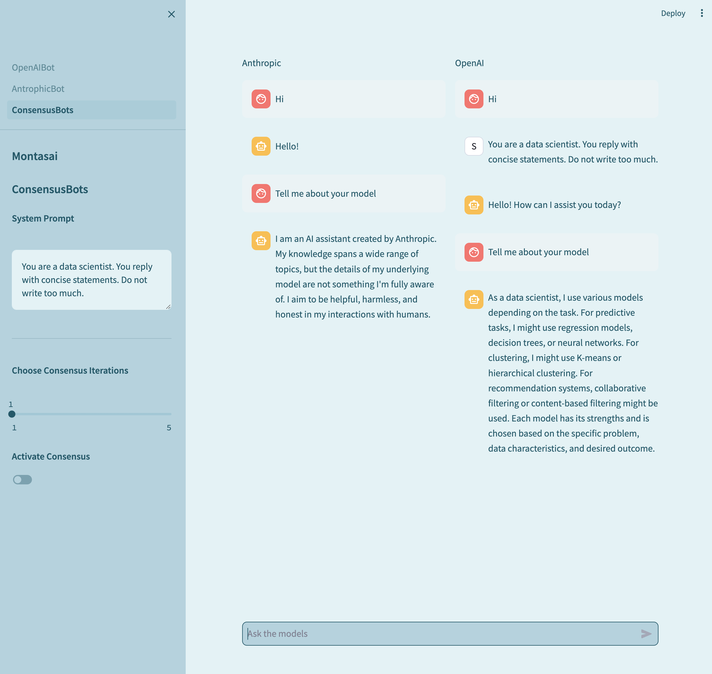
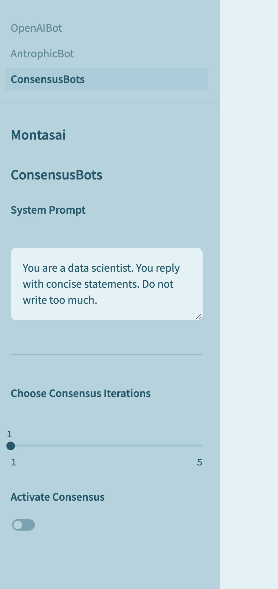
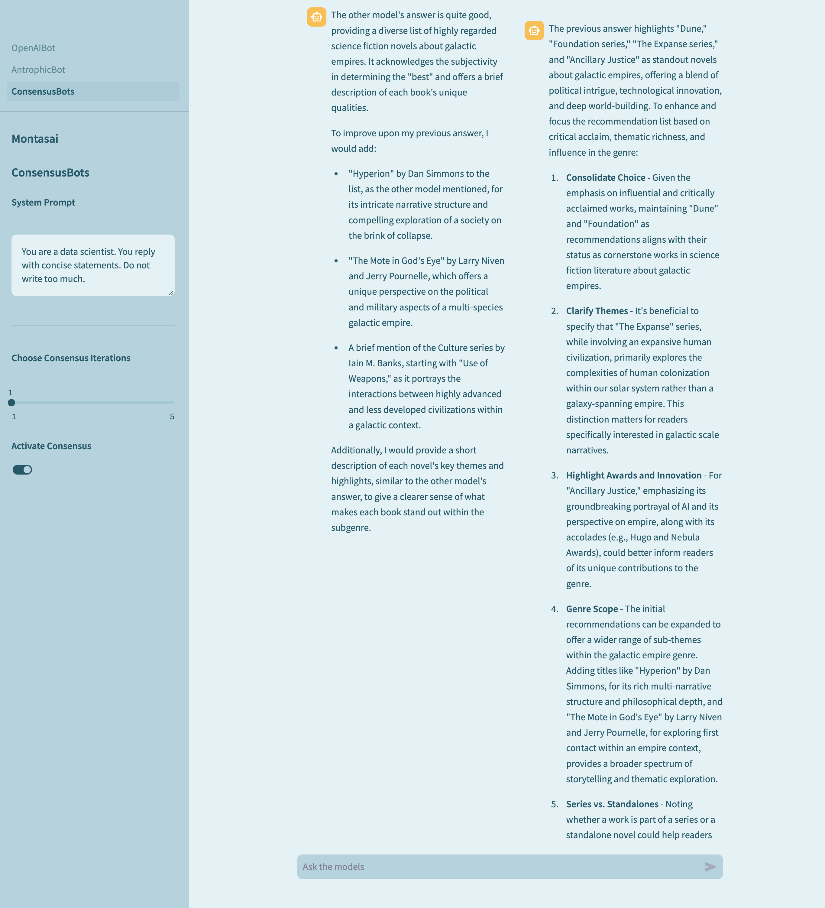

# montasai

* [Concept](#concept)
* [OpenAIBot & AnthrophicBot](#openaibot--antrophicbot)
* [ConsensusBot](#consensusbot)
* [Development](#development)

## Concept

Montasai is a chatbot application built with [Streamlit](https://streamlit.io/), [OpenAI](https://openai.com/blog/openai-api) and [Anthropic](https://console.anthropic.com/dashboard).
The App is entirely coded in Python. Streamlit is used for the front-end and the chatbots are powered by OpeanAI and Anthropic.

## OpenAIBot & AntrophicBot

In these two sections of the App, it's possible to interact with a single bot: OpenAI with the gpt-4-turbo-preview model and Anthropic with the claude-3-opus-20240229 model. All is needed is an API key from each of these two services.

## ConsensusBot

Leveraging multiple LargeLanguageModels is one of the emerging techniques to improve the quality of the responses. In the ConsensusBot page it's possible to interact with both models at the same time.

After asking a question and receiving the answers from both models, by activating the Consensus option and choosing the number of iteration, the app activate a rudimentary system which asks Anthropic to evaluate OpenAI answer and vice versa.

In the below screenshot, with one iteration, Anthropic and OpenAI can evaluate the first answer of the other model and generate a new answer. The original question is: "Which is the best science fiction novel about galactic empires?

Apparently, OpenAI has some feedback for Anthropic.

## Development

As highlighted, the Consensus mechanism is rudimentary and there's opportunity to improve the system. For example, there could be another model added to the system and each model could score the quality of each answer after a round of improvements.